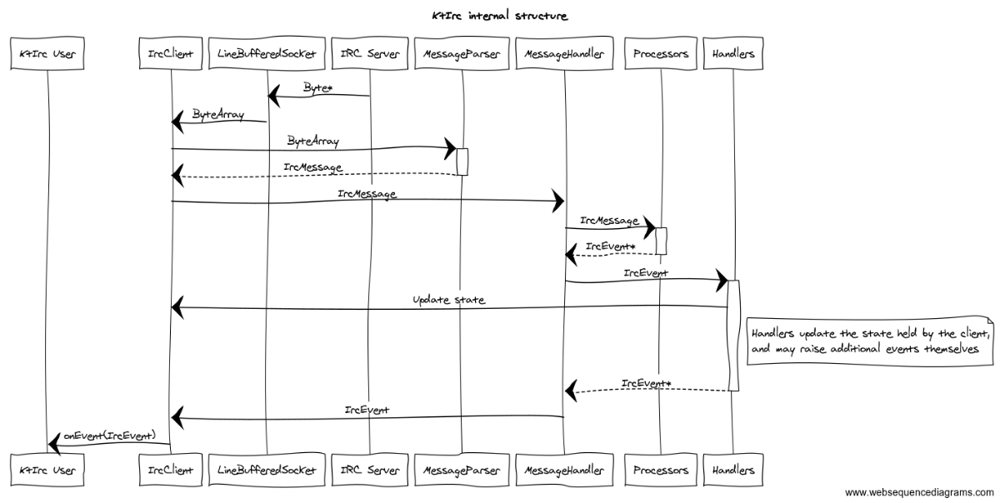

= KtIrc
Chris Smith

image:https://travis-ci.org/csmith/KtIrc.svg?branch=master[Build status, link=https://travis-ci.org/csmith/KtIrc]
image:https://api.codacy.com/project/badge/Grade/c01221cbf9cf413ba4d94cb8c80e334a[Code quality, link=https://www.codacy.com/app/csmith/KtIrc]
image:https://codecov.io/gh/csmith/KtIrc/branch/master/graph/badge.svg[Code coverage, link=https://codecov.io/gh/csmith/KtIrc]
image:https://api.bintray.com/packages/dmdirc/releases/ktirc/images/download.svg[Latest version, link=https://bintray.com/dmdirc/releases/ktirc/_latestVersion]
image:https://img.shields.io/badge/documentation-d11n-brightgreen.svg[Documentation, link=https://ktirc.d11n.dev/]

KtIrc is a Kotlin JVM library for connecting to and interacting with IRC servers.
It is still in an early stage of development.

== Features

.Built for Kotlin
KtIrc is written in and designed for use in Kotlin; it uses extension methods,
DSLs, sealed classes, and so on, to make it much easier to use than an
equivalent Java library.

.Coroutine-powered
KtIrc uses co-routines for all of its input/output which lets it deal with
IRC messages in the background while your app does other things, without
the overhead of creating a new thread per IRC client.

.Modern IRC standards
KtIrc supports many IRCv3 features such as SASL authentication, message IDs,
server timestamps, replies, reactions, account tags, and more. These features
(where server support is available) make it easier to develop bots and
clients, and enhance IRC with new user-facing functionality.

== Setup

KtIrc is published to JCenter, so adding it to a gradle build is as simple as:

[source,groovy]
----
repositories {
    jcenter()
}

dependencies {
    implementation("com.dmdirc:ktirc:<VERSION>")
}
----

== Usage

Clients are created using a DSL and the `IrcClient` function. At a minimum
you must specify a server and a profile. A simple bot might look like:

[source,kotlin]
----
val client = IrcClient {
    server {
        host = "my.server.com"
    } 
    profile {
        nickname = "nick"
        username = "username"
        realName = "Hi there"
    }
}

client.onEvent { event ->
    when (event) {
        is ServerReady ->
            client.sendJoin("#ktirc")
        is ServerDisconnected ->
            client.connect()
        is MessageReceived ->
            if (event.message == "!test")
                client.reply(event, "Test successful!")
    }
}

client.connect()
----

== Documentation

You can view the latest documentation for KtIrc at https://ktirc.d11n.dev/.

== Developing KtIrc

=== Lifecycle of a message

The `LineBufferedSocket` class receives bytes from the IRC server. Whenever it
encounters a complete line (terminated by a `CR`, `LF` or `CRLF`), it passes it
to the `IrcClient` as a `ByteArray`. The `MessageParser` breaks up the line
into its component parts (tags, prefixes, commands, and parameters) and returns
them as an `IrcMessage`.
 
The `IrcMessage` is given to the `MessageHandler`, which tries to find a
processor that can handle the command in the message. The processor's job is
to convert the message into an `IrcEvent` subclass. Processors do not get
given any contextual information or state, their job is simply to convert
the message as received into an event.

The events are returned to the `MessageHandler` which then passes them on
to all registered event handlers. The job of the event handlers is twofold:
firstly, use the events to update the state of KtIrc (for example, after
receiving a `JOIN` message, the `ChannelStateHandler` will add the user
to the list of users in the channel, while the `UserStateHandler` may update
the user's hostname if we hadn't previously seen it). Secondly, the event
handlers may themselves raise events. This is useful for higher-order
events such as `ServerReady` that depend on a variety of factors and
states.

Handlers themselves may not keep state, as they will be shared across
multiple instances of `IrcClient` and won't be reset on reconnection.
State is instead stored in the various `*State` properties of the
`IrcClient` such as `serverState` and `channelState`. Fields that
should not be exposed to users of KtIrc can be placed in these
public state objects but marked as `internal`.

All the generated events (from processors or from event handlers) are
passed to the `IrcClient`, which in turn passes them to the library
user via the delegates passed to the `onEvent` method. 

=== Contributing

Contributing is welcomed and encouraged! Please try to add unit tests for new features,
and maintain a code style consistent with the existing code.

=== Licence

The code in this repository is released under the MIT licence. See the
link:LICENCE.adoc[LICENCE] file for more info.
